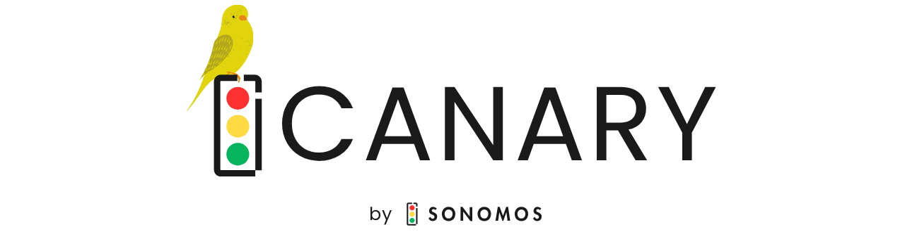

<p align="center">
  
</p>

<p align="center">
  <strong>You have no idea how much PII you've fed to Claude.</strong>
</p>

<p align="center">
  <a href="https://github.com/sonomos-ai/Canary/actions"></a>
  <a href="LICENSE"></a>
  <a href="https://github.com/sonomos-ai/Canary/releases"></a>
  <a href="https://docs.anthropic.com/en/docs/claude-code"></a>
</p>

<p align="center">
  Canary is a privacy plugin for <a href="https://docs.anthropic.com/en/docs/claude-code">Claude Code</a> that counts every piece of sensitive data you expose across all sessions.<br/>
<p align="center">  
  Credit cards. SSNs. API keys. Emails. Medical records. Crypto wallets. Names. Addresses.<br/><br/>
  <strong>The number only goes up.</strong>
</p>

---

## Install

```bash
/plugin marketplace add sonomos-ai/Canary-Plugin
/plugin install canary@sonomos
```

No API keys. No external services. No config. Two commands and you're running.

---

## What Gets Caught

<table>
<tr>
<td width="50%">

**16 Regex Detectors** (every message, ~10ms)

Real checksum validation, not just pattern matching:

- Credit cards (Luhn)
- SSNs (SSA exclusion rules)
- IBANs (MOD-97)
- Bitcoin addresses (Base58Check)
- Ethereum addresses (EIP-55)
- AWS access + secret keys
- Phone numbers, emails, IPs
- VINs (MOD-11), routing numbers (ABA)
- Medicare MBIs, driver's licenses
- URLs with embedded credentials

</td>
<td width="50%">

**70+ Semantic Categories** (Claude self-scan)

Claude scans its own context for PII that regex can't catch:

- Names, dates of birth, addresses
- Passport and national ID numbers
- Medical records, health plan IDs, diagnoses
- Legal case numbers, contracts, patents
- Trade secrets, internal communications
- Employee and customer data
- Crypto seed phrases, private keys
- OAuth tokens, JWTs, API secrets
- Financial records, tax IDs
- ...and 40+ more categories

</td>
</tr>
</table>

---

## How It Works

```
You type a message
       |
       v
Claude processes it ──> Stop hook fires (async, invisible)
                              |
                    ┌─────────┴─────────┐
               Regex Detectors      Claude Self-Scan
             (16 patterns + checksums)  (70+ categories)
                    └─────────┬─────────┘
                              v
                   ~/.sonomos/leaks.jsonl
                              |
                 Session start ──> counter displayed
```

- **Automatic**: runs on every message and every file write/edit
- **Local-only**: zero network requests, no telemetry, no external APIs
- **Non-blocking**: detection runs async, never slows your workflow
- **Persistent**: counter survives restarts, accumulates across all sessions

---

## Commands

| Command | What it does |
|---------|-------------|
| `/canary:leaked` | Open the interactive HTML dashboard |
| `/canary:leaked stats` | Print a text summary |
| `/canary:scan` | Deep-scan the full conversation history |
| `/canary:leaked reset` | Clear all detection data |

**CLI tools** (available in Bash):

```bash
canary-stats          # quick summary
canary-stats --json   # machine-readable
canary-export --csv   # export all detections
canary-export --json  # export as JSON array
```

---

## Persistent HUD

Add to `~/.claude/settings.json` to keep the counter visible at all times:

```json
{
  "statusLine": {
    "type": "command",
    "command": "bash ~/.sonomos/statusline.sh"
  }
}
```

The HUD shows your total PII count, session delta, top categories, detector breakdown, and last detection time. Color-coded by severity: **green** (0) / **yellow** (<10) / **red** (10+).

---

## Team Rollout

Drop this into your project's `.claude/settings.json` to auto-enable Canary for every developer:

```json
{
  "extraKnownMarketplaces": {
    "sonomos": {
      "source": { "source": "github", "repo": "sonomos-ai/Canary-Plugin" }
    }
  },
  "enabledPlugins": { "canary@sonomos": true }
}
```

Commit it. Every team member gets prompted to install on their next session.

---

## Privacy and Security

- All data stays on your machine at `~/.sonomos/`
- Values are **redacted at detection time** — first 2 and last 2 characters kept, middle replaced with `••`
- Files created with owner-only permissions (`0700`/`0600`)
- JSON output constructed with `jq` to prevent injection
- File path validation blocks traversal attacks
- No network requests. No telemetry. No analytics. Ever.

See [SECURITY.md](SECURITY.md) for vulnerability reporting.

---

## Why This Exists

Most developers have no idea how much sensitive data they've shared with AI tools.

The answer is almost always *more than you think*.

Canary makes that number visible and persistent. It doesn't block anything. It doesn't redact anything. It just counts. Because you can't fix what you can't see.

**Canary shows you what you've already exposed.** If you want to prevent exposure before it happens, [Sonomos](https://sonomos.ai) detects and masks PII in real time before your data ever leaves your machine.

---

## Contributing

Found a bug? Want to add a detector? PRs welcome.

```bash
git clone https://github.com/sonomos-ai/Canary.git
cd Canary
bash tests/test-detectors.sh     # regex detector tests
bash tests/test-checksums.sh     # checksum validation tests
bash tests/test-redact.sh        # redaction tests
bash tests/test-no-false-positives.sh  # false positive prevention
```

---

<p align="center">
  <a href="https://sonomos.ai"><strong>Sonomos</strong></a> &mdash; privacy engine for AI
</p>

<p align="center">
  <sub>MIT License &copy; 2026 Sonomos, Inc.</sub>
</p>
